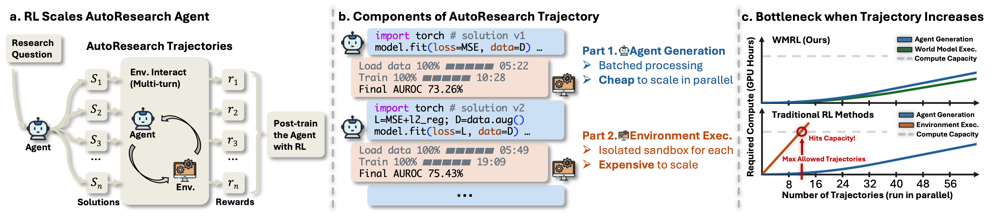

<div align="center">

# WMRL

### Scaling Automatic Research Agents via World Models

[](https://arxiv.org/abs/2608.12564)
[](https://xiyuanyang45.github.io/WMRL/)
[](LICENSE)
[](https://www.python.org/)
[](tests/)

**Train an RL agent on predicted rewards, and pay for real ones only where it counts.**



</div>

---

RL for a research agent is bottlenecked by the environment, not the model.
Generation batches, so extra trajectories are nearly free. Execution does not:
every candidate solution needs its own sandbox on real machine time. Past a
certain scale, **grading is the training cost**.

WMRL hands grading to a world model that predicts the outcome instead of
measuring it, which makes it batch like generation. The predicted reward is
wrong in two separable ways, and each gets one mechanism:

|  | corrects | how |
|---|---|---|
| 🎯 **Online Debiasing** | the systematic error | a monotone map fit online against anchor pairs, refit as the error drifts |
| 📉 **Inverse-Variance Denoising** | the random error | fuses the two reward streams weighted by inverse variance |

Both run off the **anchor stream**: about a tenth of groups are graded by *both*
the world model and real execution. Those pairs are the only ground truth in the
loop.

<div align="center">

| | GPU-hours | MLE-Dojo | DSBench |
|---|---|---|---|
| Qwen3.5-9B-GRPO *(real execution)* | 1174 | 18.8 | 31.2 |
| **Qwen3.5-9B-WMRL** | **349** <sub>3.4× less</sub> | **21.6** | **32.8** |
| Qwen3.5-4B-GRPO *(real execution)* | 883 | 15.2 | 25.7 |
| **Qwen3.5-4B-WMRL** | **286** <sub>3.1× less</sub> | **16.4** | **28.8** |

</div>

Roughly a third of the compute, higher on both held-out benchmarks, at both
scales. The 9B agent also beats an off-the-shelf agent thirteen times its size.

## Install

```bash
git clone https://github.com/xiyuanyang45/WMRL && cd WMRL
pip install -r requirements.txt
pytest tests -q                     # 99 passing, no GPU needed
```

That is enough for `wmrl/`, the algorithm itself. Training additionally needs an
inference backend and an RL trainer: `pip install -r requirements-train.txt`.

## The algorithm in twelve lines

`wmrl/` depends on nothing but numpy. No framework, no GPU, no cluster.

```python
from wmrl import CorrectionLoop, ScorerPair

loop = CorrectionLoop(
    ScorerPair(cheap=world_model, trusted=sandbox),
    anchor_fraction=0.10,           # a tenth of groups buy ground truth
)

for step in range(steps):
    result = loop.step(groups)      # groups: list of lists of trajectories
    policy.update(result.groups)    # each Group carries .advantages
    print(loop.stats())
```

`loop.step` does five things in an order that is easy to get subtly wrong:
picks the anchor groups, scores them with **both** scorers, pushes the resulting
pairs into the calibration *before* measuring disagreement, corrects everything
else, and forms advantages with anchor groups carrying the weight.

Step 3 is the one to notice. Measuring disagreement on the *calibrated* residual
is what couples the two mechanisms: as the map removes bias the residual
shrinks, and the weight relaxes on its own.

### What to watch while it trains

```python
{'step': 240, 'anchor_fraction': 0.098, 'calibrated': True,
 'bias_reduction': 0.61, 'anchor_weight': 1.84}
```

| | means |
|---|---|
| `anchor_fraction` | drifts below target when your trusted scorer's capacity binds |
| `calibrated` | while false, you are training on **raw** cheap scores |
| `bias_reduction` | how much within-group bias the current map removes |
| `anchor_weight` | 1.0 until calibrated, then rises with measured disagreement |

## Bring your own scorer

WMRL only needs two ways to score a trajectory: one **cheap** and wrong, one
**trusted** and right. A world model and a sandbox are what the paper used, not
what the method requires.

```python
from wmrl import CallableScorer, CorrectionLoop, ScorerPair

# cheap: anything fast enough to run on everything
cheap = CallableScorer("my-reward-model", "cheap",
                       lambda trajs: reward_model.predict_batch(trajs))

# trusted: anything you actually believe
trusted = CallableScorer("unit-tests", "trusted",
                         lambda trajs: [run_suite(t) for t in trajs])

loop = CorrectionLoop(ScorerPair(cheap, trusted), anchor_fraction=0.1)
```

Or implement the protocol directly when you need state:

```python
from wmrl.scorer import Scorer

class SandboxScorer(Scorer):
    name = "sandbox"
    kind = "trusted"                 # "cheap" or "trusted"

    def score(self, trajectories):
        out = []
        for t in trajectories:
            try:
                out.append(execute(t).percentile)
            except TimeoutError:
                out.append(None)     # unknown, NOT zero
        return out
```

Pairings that work, none of which are in the paper:

| cheap | trusted |
|---|---|
| a learned reward model | a unit-test suite |
| a smaller distilled model | a slow full-fidelity simulator |
| a static analyser | human labels |
| a cached lookup | a physical experiment |

**Two contract points.** Return `None`, never `0.0`, for a trajectory you could
not score: a timeout means *unknown*, and scoring it zero asserts the attempt
was bad, which poisons both the group's advantage and the calibration. And keep
the cheap scorer's *scale* stable: the calibration handles a scorer that is
systematically wrong, but not one whose meaning shifts faster than the anchor
stream can re-fit.

Swapping the two is caught at construction, because a run with them the wrong
way round trains without error and quietly ends up worse than doing nothing.

## Reproducing the paper

A run is three nodes, one per role. The split is the point: rollout and world
model inference batch together, sandbox execution cannot batch at all, so it is
fenced onto its own node where it can be scaled or starved independently.

<div align="center">

| node | role | what it does |
|:---:|---|---|
| 0 | `trainer` | policy optimisation and rollout generation |
| 1 | `world_model` | one inference engine per GPU, serving predicted rewards |
| 2 | `sandbox` | executes solutions for the anchor stream |

</div>

```bash
./ml_research/run.sh setup                 # dependencies, then the tests
./ml_research/run.sh data                  # MLE-Dojo and DSBench, resumable

export WMRL_HOSTS=node0,node1,node2        # order is role order
export WMRL_STORE=/mnt/shared/wmrl         # any path all three mount
export WMRL_RUN_ID=wmrl-9b-$(date +%F)

./ml_research/run.sh plan                  # ← run this first, on every node
./ml_research/run.sh train                 # then this, on every node
./ml_research/run.sh eval checkpoints/step-155
```

`plan` starts nothing and prints the role each node resolved. It is the cheap
way to catch a host list that does not match what the nodes call themselves,
before anything expensive begins:

```
run wmrl-9b-2026-09-10: 3 node(s)
  [0] node0                    trainer
  [1] node1                    world_model   <- this node
  [2] node2                    sandbox
```

Nothing reads a scheduler-specific variable, so the same commands work under
Slurm, a manual ssh loop, or a managed service. More nodes are fine: any node
past the third takes the `sandbox` role and widens the anchor stream.

`ml_research/configs/wmrl_9b.yaml` and `wmrl_4b.yaml` are the settings behind
the table above, down to the 45 training competitions. Worth noticing: **every
correction setting is identical across the two scales.** The mechanisms were not
retuned per model size.

## Beyond research agents

The same two mechanisms, on a problem that is not a coding agent at all:
post-training a vision-language-action policy on LIBERO-Long, where the cheap
signal is a per-frame progress prediction and the anchor is the single sparse
success the simulator returns at the end.

```bash
./embodied/run.sh sft && ./embodied/run.sh train
```

Either signal alone barely moves the policy: the sparse outcome adds 0.9 points
over the SFT baseline, the raw dense signal 1.8. Together under the same two
corrections, 3.8. See [`embodied/`](embodied/).

## Repository map

```
wmrl/                the algorithm. numpy only, ~600 lines
├── debias.py          Online Debiasing
├── denoise.py         Inverse-Variance Denoising
├── advantage.py       GRPO advantages over mixed-source groups
├── anchor.py          who pays for the trusted scorer
├── scorer.py          the two-scorer contract  ← extend here
└── loop.py            all of the above, in the right order

tests/               99 tests, including three simulated nodes shaking hands
ml_research/         AutoResearch: MLE-Dojo and DSBench      → README
embodied/            VLA post-training: LIBERO-Long          → README
docs/                the project page
```

## Notes on this release

The production stack these runs used is not public. This is a clean
reimplementation of the method and the pipeline around it, built to be read and
re-run rather than to be byte-identical. **Baselines are not included**: the
repository implements one method.

`ml_research/cluster/audit_release.py` checks the tree for infrastructure detail
that should not ship, by class rather than by literal, and runs in CI.

## Citation

```bibtex
@article{yang2026wmrl,
  title   = {Scaling Automatic Research Agents via World Models},
  author  = {Yang, Xiyuan and Sarwar, Sheikh and Cheng, Jingru and Shi, Zhan and
             Li, Duanshun and Chen, Huiyuan and Zhang, Haiyang and Fan, Xing and
             Guo, Chenlei and He, Jingrui and Liao, Zhenyu},
  journal = {arXiv preprint arXiv:2608.12564},
  year    = {2026}
}
```

<div align="center">
<sub>University of Illinois Urbana-Champaign · Amazon</sub>
</div>
